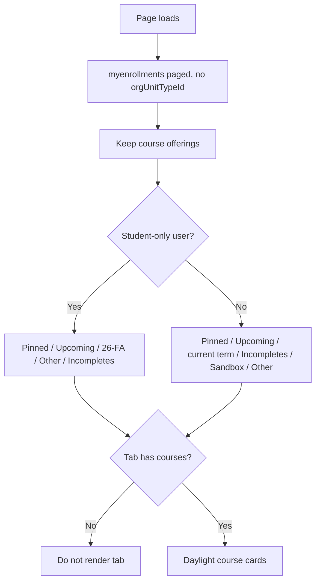

# My Courses Widget

A custom **Brightspace (D2L) homepage HTML widget** that replaces the native My Courses list with Daylight-style course cards, semester tabs that **only appear when they contain a visible course**, and role-aware availability filtering.

Originally built for **Your College**. Runs entirely in the browser using Brightspace LP/LE APIs—no separate server or OAuth app required.

---

## What it does

| Audience | Behavior |
|----------|----------|
| **Student** (role 101) | Current offerings plus **Upcoming** (before StartDate). Ended enrollments are hidden. Term tabs use codes such as `26/FA`. |
| **Incomplete Student** (role 107 / `Student2`) | Listed on **Incompletes** when D2L still grants `CanAccess`. That tab is omitted when there are none. |
| **Student View** (role 112) | Same tab set as Student. |
| **Instructor and other staff roles** | **All**, **Pinned**, **Upcoming**, a tab per instructor term (`24/WI`, `26/FA`, …), **Incompletes**, **Sandbox**, **Other**. Other is every enrollment that is not Instructor (evaluator, student course, etc.). |

A user with any non-student enrollment gets the staff tab set. Student-only users get the student tab set.

### Tabs

Empty tabs are never rendered. Active tab uses Brightspace celestine (`#006fbf`).

**Students (101 / 107)**

| Tab | When it appears |
|-----|-----------------|
| **All** | Always first; every visible course |
| **Pinned** | At least one pinned visible course |
| **Upcoming** | Student enrollments whose StartDate is still in the future |
| **24/WI, 26/SP, 26/FA, …** | Current student enrollments in that term |
| **Other** | Visible student offerings with no parseable term |
| **Incompletes** | Role 107 enrollments (omitted when none) |

**All other roles**

| Tab | When it appears |
|-----|-----------------|
| **All** | Always first; every visible course |
| **Pinned** | At least one pinned visible course |
| **Upcoming** | Instructor offerings whose StartDate is still in the future |
| **Term tabs** (`24/WI`, `26/FA`, …) | Instructor enrollments in that term, including closed past terms |
| **Incompletes** | Incomplete-role enrollments |
| **Sandbox** | Name or code contains “sandbox” |
| **Other** | Enrolled as a role other than Instructor |

Default selection is **All**.

---

## How it works



### Data sources

| API | Purpose |
|-----|---------|
| `GET /d2l/api/lp/{ver}/enrollments/myenrollments/?pageSize=100` | All pages of enrollments (bookmark paging). Course offerings filtered client-side. |
| `GET /d2l/api/lp/{ver}/courses/{orgUnitId}/image` | Card banner (same-origin cookies) |
| `PUT /d2l/api/lp/{ver}/enrollments/myenrollments/{orgUnitId}/pin` | Pin |
| `DELETE /d2l/api/lp/{ver}/enrollments/myenrollments/{orgUnitId}/pin` | Unpin |
| `GET /d2l/api/le/{ver}/{orgUnitId}/discussions/forums/` | Unread post chip when the payload includes a count |
| `GET /d2l/api/le/{ver}/{orgUnitId}/dropbox/folders/` | Ungraded chip for non-student roles when a count is present |

All requests use the browser session (`credentials: "include"`) and `X-Csrf-Token` / `X-CSRF-Token` from `localStorage` or `sessionStorage`. API paths are **relative** (no hardcoded domain).

Brightspace discussion and dropbox objects often **do not** expose unread/ungraded totals. When those fields are missing, the chips simply do not show. Set `LOAD_ACTIVITY_INDICATORS` to `false` if the extra calls are not worth it.

---

## Files in this folder

| File | Description |
|------|-------------|
| `my-courses-widget.html` | Complete widget markup + CSS + JavaScript. Copy into a D2L **Custom Widget** or homepage HTML widget. |
| `README.md` | This documentation |

---

## Requirements

- Permission to add homepage widgets
- Users must be able to call **My Enrollments** (standard for learners and instructors)
- Pin/unpin requires the same pin privilege the native My Courses widget uses
- Place on the **org homepage** (not a course homepage)

Recommended widget height: **500–700px** so a row of cards is visible without clipping.

---

## Installation (Your College)

1. Open **Admin Tools → Widgets** (or Homepage Management) and create a **Custom Widget**.
2. Paste the full contents of `my-courses-widget.html` into the HTML source.
3. Add the widget to the **student** and (optionally) **faculty** homepage layouts.
4. Hide or remove the native **My Courses** widget on those homepages so learners are not shown two lists.
5. Test as:
   - a Student with current, future, and ended enrollments
   - an Incomplete Student
   - an Instructor
   - a user who is Instructor in some courses and Student in another

**Your College staff:** a production copy also lives in [`delta-production/My Courses/`](../delta-production/My%20Courses/).

---

## Adapting for other institutions

Search `my-courses-widget.html` for the `CONFIG` block:

```javascript
var CONFIG = {
  LP_VERSION: "1.51",
  LE_VERSION: "1.78",
  STUDENT_ROLE_IDS: [101],
  INCOMPLETE_ROLE_IDS: [107],
  STUDENT_VIEW_ROLE_IDS: [112],
  STUDENT_ROLE_NAMES: ["student"],
  INCOMPLETE_ROLE_NAMES: ["student2", "incomplete student", "incomplete"],
  LOAD_ACTIVITY_INDICATORS: true
};
```

| Setting | What to change |
|---------|----------------|
| `STUDENT_ROLE_IDS` / `STUDENT_ROLE_NAMES` | Your Student org role |
| `INCOMPLETE_ROLE_IDS` / `INCOMPLETE_ROLE_NAMES` | Your Incomplete / Student2 role |
| `STUDENT_VIEW_ROLE_IDS` | Impersonation / demo-student role, or `[]` to ignore it |
| `LP_VERSION` / `LE_VERSION` | API versions your instance supports |
| `LOAD_ACTIVITY_INDICATORS` | `false` to skip discussion/dropbox calls |
| Brand color | `#006341` (Delta green) in the CSS string and pin-active style |

Semester labels come from offering codes such as `ENG-111-FA802-26/FA`. If your codes do not include `yy/TERM`, tabs fall back to the offering name (`Fall 2026`) or **Other**.

---

## Customization checklist

- [ ] Confirm Student and Incomplete role IDs in **Roles and Permissions**
- [ ] Paste widget HTML and set homepage placement
- [ ] Hide native My Courses on the same homepage
- [ ] Student: future course hidden until StartDate; ended course hidden after EndDate
- [ ] Student: semester tab for a term with no visible courses does not appear
- [ ] Incomplete: course still listed after the original semester ended (if `CanAccess` is true)
- [ ] Instructor: future, past, and inactive courses still listed
- [ ] Pin / unpin updates immediately and persists on refresh
- [ ] Course banner loads, or initials placeholder shows on 404
- [ ] Search filters cards and hides tabs that no longer have matches
- [ ] Dual-role user: teaching courses unrestricted, student enrollment date-filtered

---

## Troubleshooting

| Symptom | Likely cause |
|---------|----------------|
| Students still see a future semester tab | Offering StartDate is already in the past, or the user is not in a Student/Incomplete role on that offering |
| Incomplete course missing | `CanAccess` is false; the incomplete enrollment may need dates extended in the offering |
| Faculty missing a future course | They are enrolled as Student in that offering (date rules apply to that enrollment) |
| Empty widget | No type-3 enrollments, or API/session error — check the browser console |
| Pin button does nothing | Missing pin privilege or CSRF token; console will show HTTP 403 |
| No banner image | Course has no image; initials placeholder is expected |
| No unread/ungraded chips | API objects have no count fields, or `LOAD_ACTIVITY_INDICATORS` is false |

---

## Security and privacy notes

- The widget only loads **the logged-in user’s** enrollments.
- No external servers, API keys, or CSV files.
- Activity calls are same-origin and fail silently on 403.

---

## Related widgets

- **Upcoming Courses** — SIS-based list of enrollments that have **not started yet** (complements this widget for students)
- **Student Incomplete Courses** — dedicated incomplete-course list with instructor names

---

## License and contribution

Shared for use and adaptation by other Brightspace administrators. Replace role IDs and branding before deploying to your own org.

---

## Credits

Developed by **Your College** eLearning / D2L administration.

**Version notes:**

- Student / Incomplete / Student View enrollments are the only ones filtered by availability
- Tabs render only when they contain a visible course
- LP `1.51`, LE `1.78`
- Pin via My Enrollments pin endpoint
- Daylight card UI with Delta `#006341` accent
